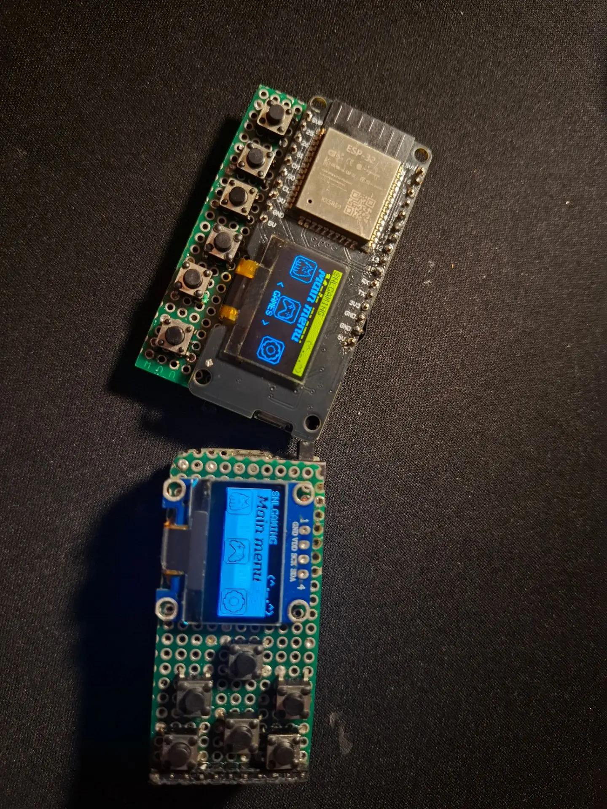

# SNLGAMING ESP32

<p align="center">
  
</p>

<p align="center">
  ESP32 handheld gaming firmware with OLED UI, games, apps, virtual pet, EEPROM storage and DFPlayer Mini support.
</p>

---

## 🎮 About

**SNLGAMING ESP32** is a handheld gaming project based on the ESP32.

The project contains two firmware versions for different hardware configurations.

The firmware includes games, applications, settings, a virtual pet, EEPROM data storage, OLED graphics and DFPlayer Mini audio support.

---

## 📦 Firmware versions

### 1. SNLGAMING-ESP32

**OLED:** SSD1306, 128×64, I2C `0x3C`  
**SDA:** GPIO 21  
**SCL:** GPIO 22

| Button | GPIO |
|---|---:|
| UP | 27 |
| DOWN | 26 |
| SELECT | 25 |
| BACK | 14 |
| LEFT | 32 |
| RIGHT | 33 |

| Device | GPIO |
|---|---:|
| Speaker | 23 |
| DFPlayer RX | 16 |
| DFPlayer TX | 17 |

### 2. SNLGAMING-ESP32-OLED

**OLED:** SSD1306, 128×64, I2C `0x3C`  
**SDA:** GPIO 5  
**SCL:** GPIO 4

| Button | GPIO |
|---|---:|
| UP | 13 |
| DOWN | 12 |
| SELECT | 15 |
| BACK | 16 |
| LEFT | 14 |
| RIGHT | 2 |

| Device | GPIO |
|---|---:|
| Speaker | 23 |
| DFPlayer RX | 16 |
| DFPlayer TX | 17 |


---

## 🕹️ Games

- Snake
- Pong
- Racer
- Dino
- Shooter
- Flappy Bird
- Arkanoid
- Tanks
- Tetris

## 📱 Applications

- Stopwatch
- Flashlight
- Calculator
- Random Generator
- Command Line
- SoundPad
- MP3 Player
- 3D Render

## 🐾 Virtual Pet

The main menu includes a **Pet** section. Pet data is stored in EEPROM.

## ⚙️ Main Menu

- Games
- Settings
- Apps
- Pet

## 💾 EEPROM

```cpp
EEPROM.begin(64);
```

The firmware stores game records, settings and pet data.

## 🔊 DFPlayer Mini

```cpp
Serial2.begin(9600, SERIAL_8N1, 16, 17);
```

```cpp
#define MP3_TRACKS 20
```

Library: `DFRobotDFPlayerMini`.

## 💻 Command Line

```text
snldo help
snldo info
snldo games
snldo apps
snldo pet
snldo records
snldo theme
snldo reboot
snldo code
```

## 🔧 Required Libraries

- Adafruit GFX Library
- Adafruit SSD1306
- DFRobotDFPlayerMini
- Wire
- EEPROM
- Arduino

## 🛠️ Arduino IDE

Add this ESP32 Boards Manager URL:

```text
https://espressif.github.io/arduino-esp32/package_esp32_index.json
```

Then install **esp32 by Espressif Systems** through Boards Manager.

Install the required libraries through Library Manager.

## 📂 Project Structure

```text
SNLGAMING-ESP32
├── README.md
├── .gitignore
├── images
│   └── snlgaming.jpg
├── docs
│   └── wiring.md
├── firmware
│   ├── SNLGAMING-ESP32
│   │   └── SNLGAMING-ESP32.ino
│   └── SNLGAMING-ESP32-OLED
│       └── SNLGAMING-ESP32-OLED.ino
├── snlfirmwaresps32.bin
├── snlfirmwaresps32oled.bin
├── код snlgaming esp32.txt
└── код snlgaming esp32 oled.txt
```

## 📥 Firmware Files

The repository contains precompiled `.bin` firmware files:

- `snlfirmwaresps32.bin`
- `snlfirmwaresps32oled.bin`

## 📄 Source Code

Original source `.txt` files are also included. Arduino-compatible `.ino` files are located in the `firmware` directory.

## 🔌 Wiring

Detailed wiring information:

```text
docs/wiring.md
```

## ⚠️ Hardware Compatibility

Before flashing, check the GPIO configuration for the selected firmware version.

## 📜 License

No license has been declared for this project yet.

---

## 🚀 SNLGAMING

**ESP32 • OLED • Games • Apps • Virtual Pet • Audio**

Enjoy the project! 🎮
